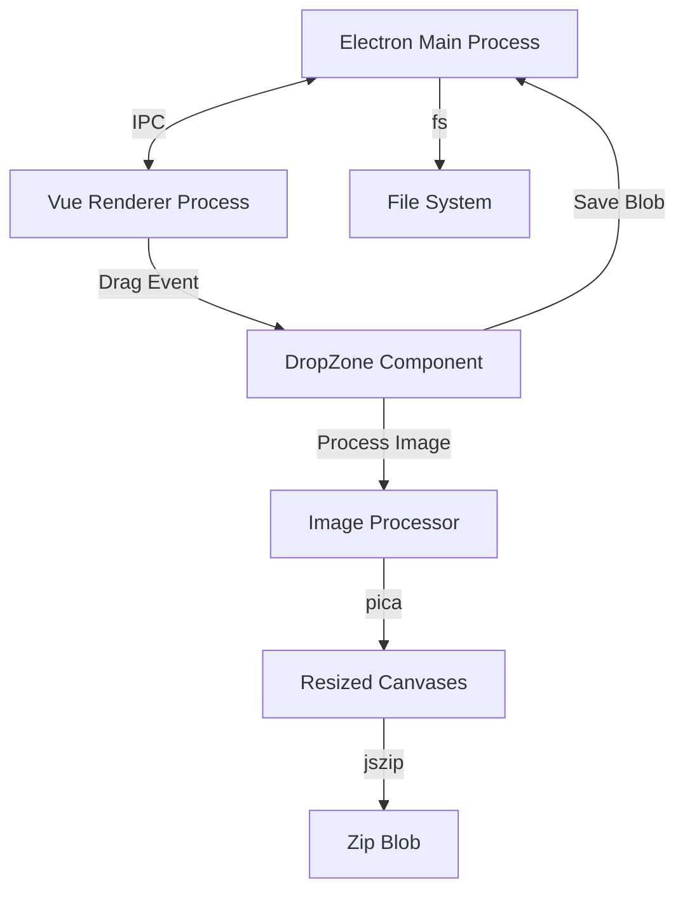

# System Architecture

## Overview
The application follows a standard **Electron + Vue 3 + Vite** architecture, separating the **Main Process** (Node.js backend) from the **Renderer Process** (UI).

## Key Components

### 1. Main Process (`electron/main.ts`)
-   Entry point of the desktop application.
-   Manages application lifecycle and window creation.
-   **Security Decision**: Enabled `nodeIntegration` and disabled `contextIsolation` to bypass complex preload script compilation issues with Vite. This allows direct communication but should be noted for security reviews (acceptable for a local utility tool).
-   **IPC Handlers**:
    -   `save-dialog`: Opens native OS "Save As" dialog.
    -   `save-file`: Writes the generated Zip buffer to disk.
    -   `show-item-in-folder`: Reveals the saved file in Explorer/Finder.

### 2. Renderer Process (`src/`)
-   **Vue 3**: Reactive UI framework.
-   **Vite**: Build tool and dev server.
-   **DropZone.vue**: Core component handling:
    -   Drag & Drop events.
    -   Click-to-select file input.
    -   UI state (processing, success, error).
    -   Responsive layout using Flexbox.

### 3. Image Processing (`src/utils/imageProcessor.ts`)
-   **Pica**: High-quality image resizing library (better than standard Canvas scaling).
-   **JSZip**: Client-side Zip creation.
-   Runs in the Renderer process main thread (batched to prevent freezing).

## Build Pipeline
1.  **Vite Build**: Compiles Vue/TS into `dist/`.
2.  **Electron Build**: Compiles `electron/main.ts` into `dist-electron/`.
3.  **Electron Builder**: Packages both into a Windows `.exe` (NSIS installer) in `release/`.
